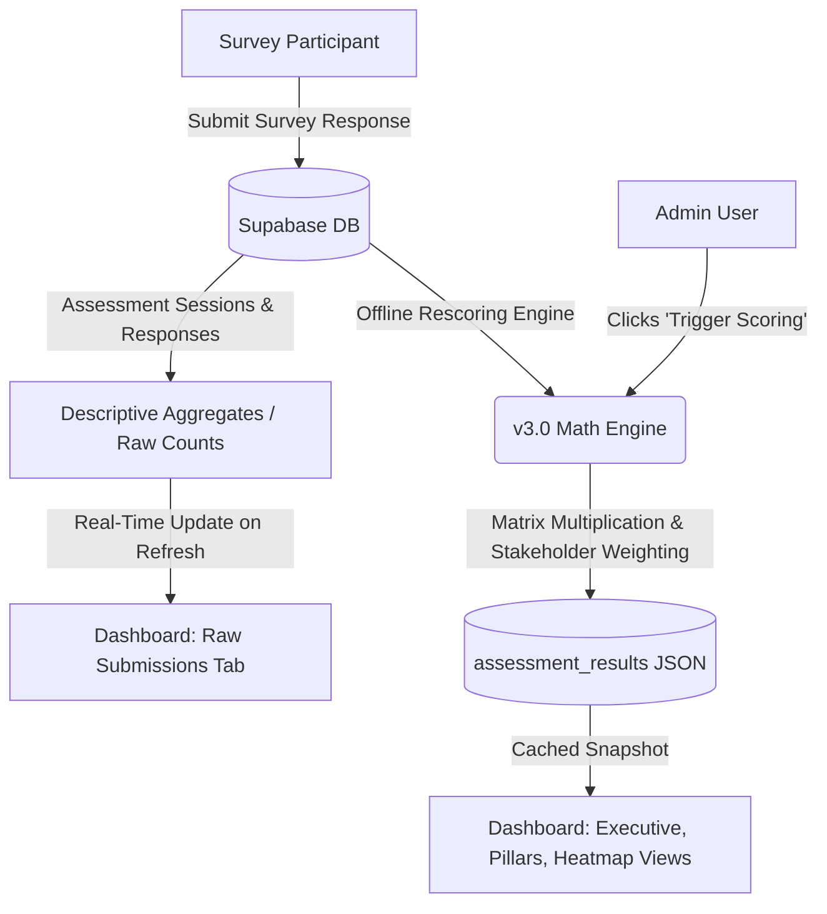

# Live Mode Migration Plan & Concurrency Hardening Checklist
### Barbados Digital ID Assessment Framework — Production Transition Guide

This document outlines the complete architectural, infrastructure, database, and operational roadmap to transition the application from **Test Mode** to **Live Mode** within a 24-hour window. It ensures that the system remains 100% responsive when **200+ users** submit surveys concurrently, and explains how decision-makers will interact with the live dashboard.

---

## 1. Live Dashboard Operation: Real-time vs. Cached Aggregates

One of the most important questions before launching is whether the dashboard displays live metrics in real-time or if it requires recomputation. 

Our v3.0 mathematical scoring engine is **highly decoupled for performance**. Here is how it behaves:

### Dual-Layer Dashboard Architecture


### 1. Real-Time View (No Recomputation Required)
The descriptive aggregations of submissions, respondent lists, raw data quality logs, and question aggregations are fetched **directly and in real-time** from Supabase.
* **What Updates Instantly:** Total session counts, organization representation, respondent sector statistics, and raw text comments.
* **Why:** The dashboard queries `assessment_sessions` and `assessment_responses` dynamically, and runs lightweight aggregations client-side (`aggregateStakeholderResponses` in `assessmentAggregation.ts`).

### 2. Computed View (Requires Cached Recomputation)
The primary mathematical scoring elements (Maturity Levels, Pillar & Subpillar indices, Heatmaps, and Stakeholder Discrepancy analysis) are read from the `assessment_results` table.
* **What is Cached:** The complex math (e.g., 70% Primary vs 30% Secondary stakeholder weighting, 5% triangulation bonuses, BARS mappings, and indicator scoring).
* **Why this is a Major Advantage for Concurrency:** By not executing the scoring engine on *every single submission*, the database is completely protected. If 200 users click submit at the exact same moment, the writes occur in under 100ms. The system does not choke on expensive mathematical matrix calculations.

### How to Keep the Dashboard Updated for Decision Makers:
* **The Manual Trigger (Highly Recommended):** Log into the Admin Dashboard, navigate to the **Admin Actions** tab, and click **"Trigger Scoring / Rescore"**. This issues a POST to `/api/admin/rescore`, running the v3.0 scoring engine over all submitted inputs. The math engine runs and caches the results in **under 3 seconds**. 
* **The Launch Day Workflow:** Let participants complete the survey. At the end of the survey window (or at lunch/breaks), click **"Trigger Scoring"** once. All dashboard tabs (executive summaries, heatmaps, discrepancies) will immediately refresh to reflect the exact state of submissions.

---

## 2. High-Concurrency Concurrency Audit & Checklist (200+ Concurrent Users)

When 200+ users submit surveys at the same time (e.g., at the end of an interactive presentation or workshop), the load spike can cause basic database connections or serverless functions to throttle. 

Use this checklist to guarantee **100% uptime**:

- [ ] **1. Upgrade to Vercel Pro Tier ($20/month)**
  * *Why:* The Vercel Hobby (free) tier has soft limits on serverless execution concurrency, bandwidth, and API timeouts. Upgrading to a Pro tier guarantees instant cold starts, handles concurrent HTTP bursts easily, and increases the API timeout ceiling from 10 seconds to 60 seconds.
  * *Action:* Upgrade your workspace organization on Vercel to Pro before launch day. You can downgrade after the survey window closes if desired.

- [ ] **2. Verify `SUPABASE_SERVICE_ROLE_KEY` in Vercel Environment Variables**
  * *Why:* The Next.js submission route `/api/assessment/submit/route.ts` uses the `SUPABASE_SERVICE_ROLE_KEY` (admin client) to write submissions. If this key is missing from Vercel's environment variables, the system falls back to the public anonymous key. Falling back to the anon key forces Supabase to evaluate Row Level Security (RLS) policies for every single row insertion, creating heavy CPU overhead under high load.
  * *Action:* Ensure `SUPABASE_SERVICE_ROLE_KEY` is copy-pasted into Vercel and is identical to your `.env.local` service key. This bypasses RLS on inserts, speeding up submission times by **3x to 5x**!

- [ ] **3. Leverage Supabase Connection Pooling (PostgREST HTTP)**
  * *Why:* 200 users opening direct TCP connections to PostgreSQL would exhaust the limits of standard Postgres instances.
  * *Action:* Make sure your Next.js frontend is communicating via the Next.js API endpoint `/api/assessment/submit` rather than direct TCP database client drivers. Since our SDK client uses the stateless **PostgREST HTTP API**, it opens HTTP REST connections, executes inserts in milliseconds, and closes immediately. **This makes our database connection model highly scalable by default.**

- [ ] **4. Maintain Wi-Fi and Network Resilience via LocalStorage (Built-in!)**
  * *Why:* 200 physical participants in a room using the same Wi-Fi access point will experience network latency or packet drops.
  * *Action:* Rest easy knowing our survey components (`SurveyShell.tsx`, `AssessmentForm.tsx`) are already equipped with **automatic LocalStorage draft-saving**. If a user's submit request fails due to a brief Wi-Fi dropout, their progress is kept safe on their local browser. They will see an error, but they can simply click "Submit" again without losing a single character of their input.

---

## 3. Step-by-Step Live Migration Roadmap (24-Hour Plan)

Follow these phases in chronological order to transition safely into **Live Mode**.

### Phase A: Database Cleaning and Preparation (T-Minus 18 Hours)

- [ ] **1. Clear Synthetic Test Data**
  * *Action:* Log in as an administrator on the dashboard. Go to the Admin tab and execute the **Purge Test Data** API command. Under the hood, this triggers `/api/admin/purge-test-data` with `confirmBackup: true`.
  * *Safety check:* Confirm that all records marked `environment_mode = 'test'` are deleted. Our system has an absolute hard-coded block that prevents `environment_mode = 'live'` from ever being affected by this purge.

- [ ] **2. Verify Administrator Profiles**
  * *Action:* Ensure your key administrators have been signed up and assigned their roles. 
  * *Database verification:* Under the `profiles` table in Supabase, ensure that the users who need admin access have their `role` column set strictly to `'admin'`. Those who only need to read the dashboard should be set to `'viewer'`.

- [ ] **3. Run Database Connection Diagnostics**
  * *Action:* Run the built-in connection diagnostic script in your terminal to ensure everything is verified:
    ```bash
    npm run ts-node scripts/test-connection.ts
    ```

---

### Phase B: Indicators Seeding (T-Minus 12 Hours)

Secondary national statistics (represented by `indicator_values`) must be active for the scoring calculations to succeed in **Live Mode**. 

- [ ] **1. Migrate Indicators from Test to Live**
  * *The Problem:* You have spent time populating indicators in `test` mode, and need them to match exactly in `live` mode without typing them out one by one.
  * *The Action:* Run the following SQL block in the **Supabase SQL Editor** to copy all indicators from test to live for Rubric 3.0 instantly:

```sql
-- COPY ALL INDICATORS FROM TEST TO LIVE MODE INSTANTLY
INSERT INTO public.indicator_values (
    indicator_code, 
    pillar_code, 
    subpillar_code, 
    raw_value, 
    source, 
    source_url, 
    data_date, 
    notes, 
    environment_mode, 
    rubric_version
)
SELECT 
    indicator_code, 
    pillar_code, 
    subpillar_code, 
    raw_value, 
    source, 
    source_url, 
    data_date, 
    notes, 
    'live', -- change target environment to live
    rubric_version
FROM public.indicator_values
WHERE environment_mode = 'test'
ON CONFLICT (indicator_code, environment_mode, rubric_version) 
DO UPDATE SET 
    raw_value = EXCLUDED.raw_value,
    source = EXCLUDED.source,
    source_url = EXCLUDED.source_url,
    data_date = EXCLUDED.data_date,
    notes = EXCLUDED.notes,
    updated_at = NOW();
```

- [ ] **2. Verify Live Seeding**
  * *Action:* In your Supabase table view, select `indicator_values` and filter by `environment_mode = 'live'`. Confirm that all 51 indicator codes are populated.

---

### Phase C: Release Build & Deployment (T-Minus 6 Hours)

- [ ] **1. Perform a Local Production Build Test**
  * *Action:* Run the following commands locally to ensure there are no lints or TypeScript compiler errors:
    ```bash
    npm run build
    ```
  * *Why:* Vercel deployment will fail if there are any lingering compilation warnings or incorrect file paths. Catching them locally is crucial.

- [ ] **2. Check Environment Toggles**
  * *Action:* Ensure that the main system configuration parameters in Vercel do *not* have hardcoded test parameters. Check that `NEXT_PUBLIC_APP_ENV` is set to `production`.

- [ ] **3. Push to Release Branch and Deploy**
  * *Action:* Push your latest stable changes to your production branch (e.g. `main` or `production`) and verify in the Vercel dashboard that the build completes and is successfully assigned your official domain name.

---

### Phase D: Launch & Monitoring (Go-Live Hour)

- [ ] **1. Execute a Live Smoke-Test Submission**
  * *Action:* Open the public link in an incognito window, fill out a single mock survey, and hit submit.
  * *Verification:* 
    1. Check that you are seamlessly redirected to the `/thank-you` screen.
    2. Log into the admin dashboard (under `live` mode) and verify that you see **1 live session** recorded.
    3. Delete this mock session using the admin's **Delete/Archive** button to return the live database to 0 submissions before participants begin.

- [ ] **2. Distribute Public Links**
  * *Action:* Share the clean URLs with stakeholders:
    * **Expert Assessment:** `https://your-domain.gov.bb/expert`
    * **Stakeholder Assessment:** `https://your-domain.gov.bb/stakeholders`
  * *Safety Alert:* Ensure that **no public links** contain `?mode=test`. Public URLs must remain clean so that they fall back automatically to the secure `'live'` mode.

- [ ] **3. Monitor Concurrency**
  * *Action:* Keep the Supabase console open under **Database > API** or **Database > Activity** to monitor real-time CPU consumption.
  * *Action:* At the end of the survey period, click **"Trigger Scoring"** from the Admin dashboard to compute final, beautiful dashboards for your decision makers.

---

## 4. Summary: Quick Reference Dashboard Commands

Keep these commands handy during the migration process:

| Action | URL / Endpoint | Access | Recommended Schedule |
|---|---|---|---|
| **Purge Test Data** | `/api/admin/purge-test-data` | Admin Only | Run once before launching Live mode. |
| **Rescore live data** | `/api/admin/rescore` | Admin Only | Run once at the end of the survey window. |
| **Export raw CSVs** | Admin Dashboard > Exports Tab | Admin/Viewer | Run after final rescoring for offline reporting. |
| **Public Survey** | `/expert` or `/stakeholders` | Public | Distributed to participants. |
